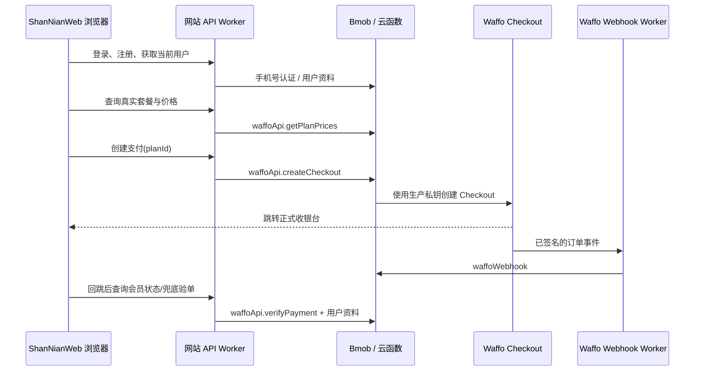

# 闪念官网登录与正式购买实施计划

## 1. 目标

把 `ShanNianWeb` 从纯展示官网升级为可完成以下闭环的网站：

1. 手机号短信登录；未注册手机号自动创建闪念账号。
2. 密码注册、密码登录与找回密码。
3. 显示 Waffo 正式环境的真实 SKU 与实时价格，不再展示硬编码的 App Store 占位价格。
4. 登录用户可在网站发起 Waffo 正式支付、跳转收银台、回到成功页并确认会员已开通。
5. 网站、桌面端和 Android 共用同一个 Bmob `_User` 账号与会员字段。

## 2. 当前情况

### 网站

- 网站是静态 HTML：`index.html`。
- 定价区的价格和按钮目前是静态文案，按钮跳转 App Store，不会创建 Waffo 支付订单。
- 现有成功页为 `waffo/success/index.html`，只展示静态“支付成功”提示。

### 已有后端能力

- Bmob `waffoApi` 已负责：查询价格、创建 Waffo Checkout、查询订单并开通会员。
- Bmob `waffoWebhook` 已负责：接收经过 Cloudflare Worker 验签的 Waffo 回调，更新 `_User.isPro`、`proType`、`proExpireDate`。
- 桌面端已实现手机号短信登录、密码登录/注册/重置密码，以及 `createCheckout` / `verifyPayment` 流程。

### 正式 SKU 的唯一来源

网站不保存金额，不直接请求 Waffo，也不持有 Waffo 私钥。SKU 和实时价格统一从生产 `waffoApi` 的 `getPlanPrices` 获取：

| 网站套餐 | 计划 ID | 当前生产商品 ID |
| --- | --- | --- |
| 月度订阅 | `monthly` | `PROD_0s4GOpN0yppXDB66Ko2VZJ` |
| 年度订阅 | `yearly` | `PROD_77aBaYDZSDPh5sm10sY23m` |
| 早鸟终身 | `lifetime_early_bird` | `PROD_2JTpwCHXGBCUJQIzHlN0SP` |
| 常规终身 | `lifetime` | `PROD_1Qkx8HdrLU6RG13Wqh1mBY` |

隐藏的 `waffo_production_test` 商品不在官网展示，也不能由前端传入。

## 3. 目标架构

### 网站 API Worker

扩展现有 Cloudflare `waffo-webhook` Worker，在保留 `POST /waffo/webhook` 回调路由的同时，新增网站 `/api/*` 路由，负责：

- 代理 Bmob 的短信、登录、注册、密码重置和当前用户查询。
- 将用户 `sessionToken` 转发给 `waffoApi`，调用 `getPlanPrices`、`createCheckout`、`verifyPayment`。
- 仅允许官网域名的 CORS 来源，统一限流、参数校验和错误格式。

浏览器只保存 Bmob 的短期 `sessionToken` 与公开用户资料；不会保存 Bmob REST/Master Key、Waffo 私钥或 Webhook 密钥。所有密钥仅放在 Worker / Bmob 的 Secret 中。

## 4. 实施步骤

### 阶段 A：基础与 API

1. 扩展现有 `waffo-webhook` Worker，复用其中的 Bmob App ID、REST Key Secret。
2. 实现认证接口：发送短信、短信登录/自动注册、密码登录、密码注册、重置密码、登出、当前用户。
3. 复用桌面端的手机号验证规则和 Bmob `_User` 字段，确保同一个手机号进入同一个账号。
4. 实现受登录态保护的会员接口：`GET /me/membership`、`GET /plans`、`POST /checkout`、`POST /payments/verify`。

### 阶段 B：官网前端

1. 将 `index.html` 拆分为可维护的静态模块：认证弹窗、用户菜单、价格卡片、购买状态提示。
2. 导航栏加入“登录 / 注册”和登录后的头像、会员状态、退出登录入口。
3. 价格区加载 `/plans` 返回的真实价格；加载失败显示明确错误，不回退到伪造金额。
4. 每张套餐卡片仅传递固定白名单 `planId`，未登录时先打开认证弹窗，登录后调用 `/checkout` 并跳转 Waffo Checkout。
5. 根据登录用户和会员等级禁用不应重复购买的套餐。

### 阶段 C：支付回跳与会员同步

1. 调整 `waffo/success/index.html`：读取网站登录态，而非只显示静态提示。
2. 回跳后轮询会员状态；若 Webhook 尚未完成，调用一次受限的 `verifyPayment` 作为兜底。
3. 成功后展示套餐、到期时间或终身会员状态，并提供“返回官网”和“下载桌面端”。
4. `waffoWebhook` 仍是最终发货依据；前端不得仅凭 URL 参数授予会员。

### 阶段 D：真实 SKU 与运营规则

1. 以 Waffo 返回价格作为官网唯一展示价格，移除 `¥18`、`¥128`、`¥188` 等硬编码文案。
2. 确认四个正式 SKU 的启用状态、币种、税费展示和月/年订阅周期。
3. 明确早鸟终身的展示条件：沿用桌面端首次使用 3 天规则，或改为官网统一活动规则。
4. 不在官网显示低价内部验证商品；它仅保留在桌面端隐藏入口。

### 阶段 E：安全与验收

1. 登录接口设置限流、短信发送冷却、统一错误信息，避免枚举手机号。
2. 会话 token 使用 `sessionStorage`；页面刷新后可通过 `/me` 恢复状态，登出时清除。
3. 校验 CORS、Content Security Policy、HTTPS、回跳白名单和所有 `planId` 白名单。
4. 记录不包含密钥的订单 ID、用户 ID、回调结果和错误日志，便于处理未到账投诉。

## 5. 验收清单

- 新手机号可通过短信自动注册并登录；已有手机号可登录且账号与桌面端一致。
- 密码注册、密码登录和重置密码均可用。
- 官网显示的价格来自生产 `waffoApi`，与 Waffo 后台一致。
- 未登录不能创建支付；伪造/未知 `planId` 被 API 拒绝。
- 月付、年付、终身三种正式支付均能打开 Waffo 正式收银台。
- 支付后 Webhook 自动更新会员；回跳页可在合理时间内显示会员已生效。
- Webhook 延迟时，网站验单兜底只更新当前登录用户自己的订单。
- 网站、桌面端、Android 对同一账号显示一致的会员状态。

## 6. 部署顺序

1. 先重新部署扩展后的现有 `waffo-webhook` Worker；原有三个 Secret 保持不变。
2. 部署官网前端到 `ShanNianWeb` 当前托管环境。
3. 保持已工作的 Bmob `waffoApi`、Bmob `waffoWebhook` 不变；网站 API 与 Waffo 回调共用同一个 Cloudflare Worker。
4. 先用 Waffo 测试环境完成端到端测试，再切换网站 API 到生产域名与生产 SKU。

## 7. 实现边界

- 本次网站购买复用已经验证的 Waffo/Bmob 会员体系，不新建第二套订单或会员数据库。
- 网站不会包含 Waffo 私钥、Bmob Master Key 或 Webhook 密钥。
- 购买完成后的会员权益由服务端和 Webhook 决定，页面只负责展示状态。
